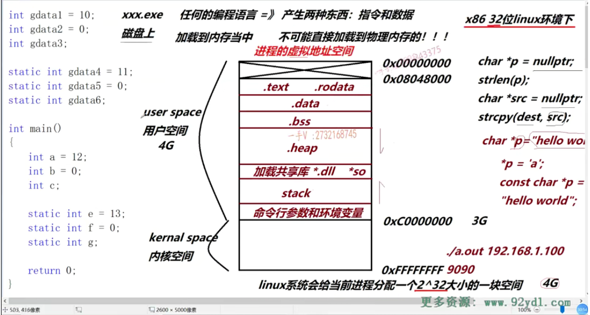
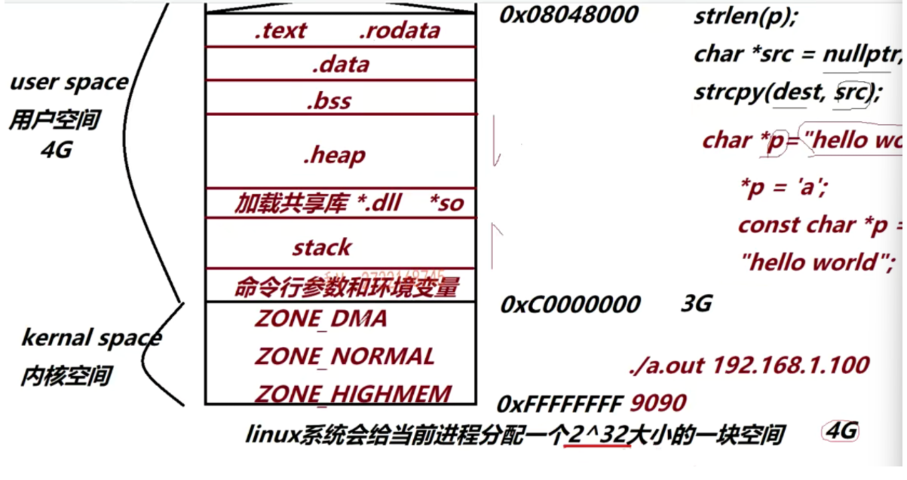

0x00000000——0x0804800：预留，不能访问。所以以下代码会出现错误：

```c++
char *p = nullptr;
strlen(p);
char *src = nullptr;
strcpy(dest,src);//因为不能访问0地址空间开始的区域
```

 .text:指令运行时所放在的区域。（只读）不能写

.rodata:只读数据区（“hello”）

.data:存放初始化,初始化不为0的变量（上图代码中的：gdata1，gdata4存在该区域）

.bss:存放初始化，且初始化为0的变量，（全局变量），操作系统会将该区域内的数据全部设置为0。（上图代码中：gdata2，gdata3，gdata5,6；

.heap:堆内存，从上往下进行增长

stack:栈空间，从下往上进行增长

ZONE_NORMAL:pcd,进程控制块

全局变量，静态局部变量：上图代码中的全局变量都是数据，编译后都会是数据；所以放在.data.bss里

局部变量：`int a = 12`编译后得到的是一条指令`mov dword prt[a],Och`.所以在.text段

**注意：每一个进程的用户空间是私有的，而内核空间是共享的**————》进程之间的通信：匿名管道通信，就是通过在共享的内核空间上分配一块共享的内存区域实现

