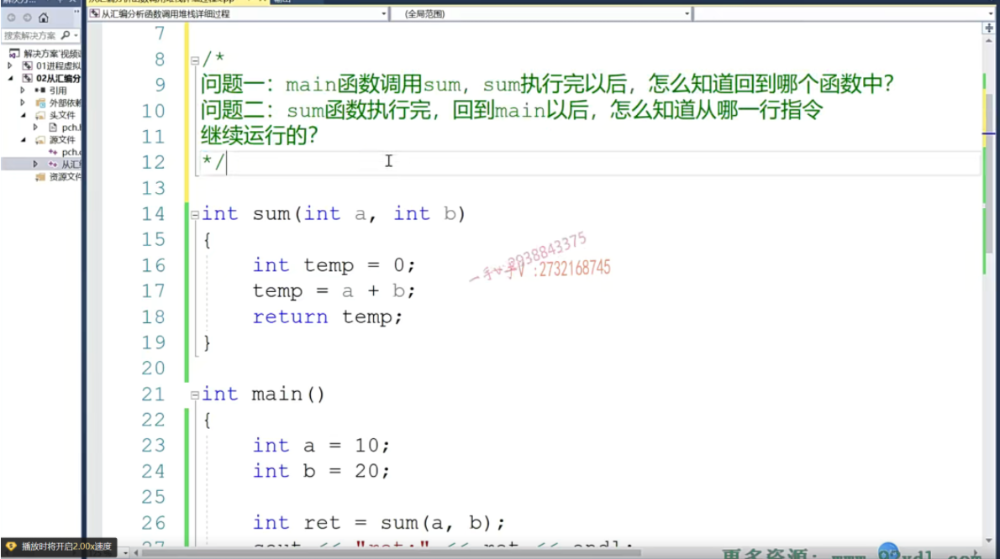
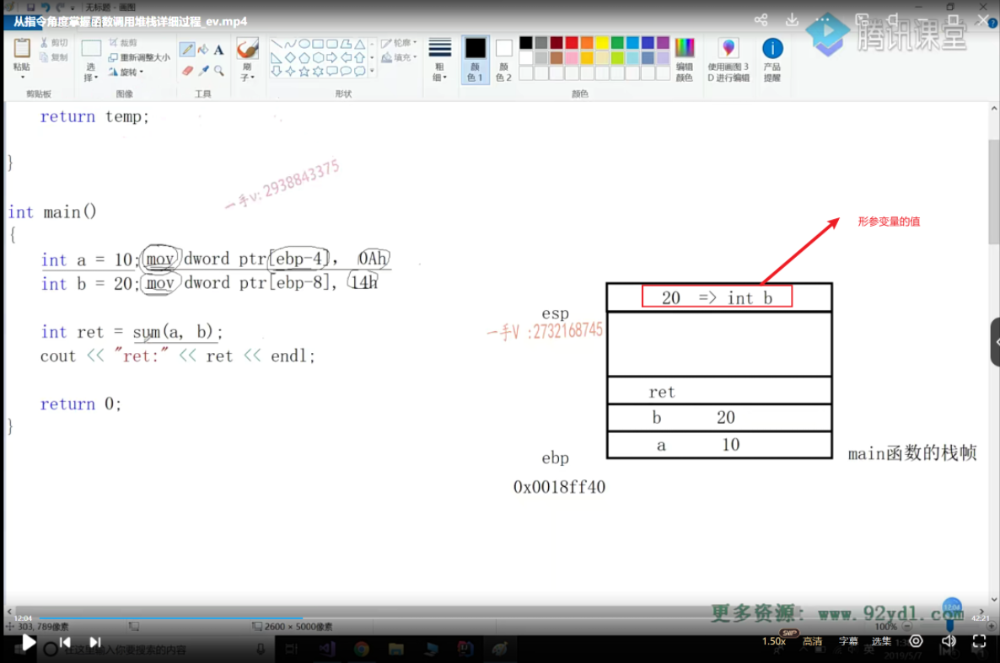
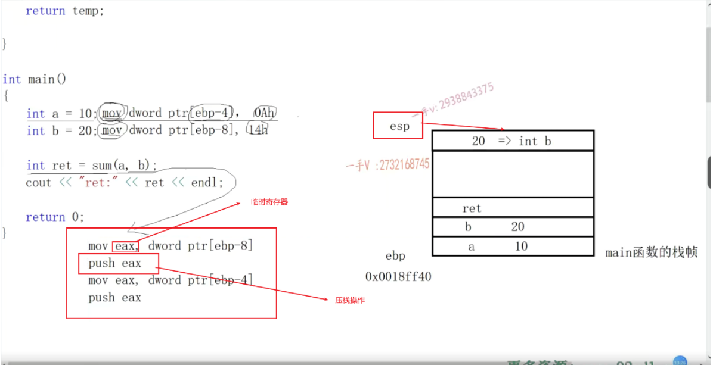
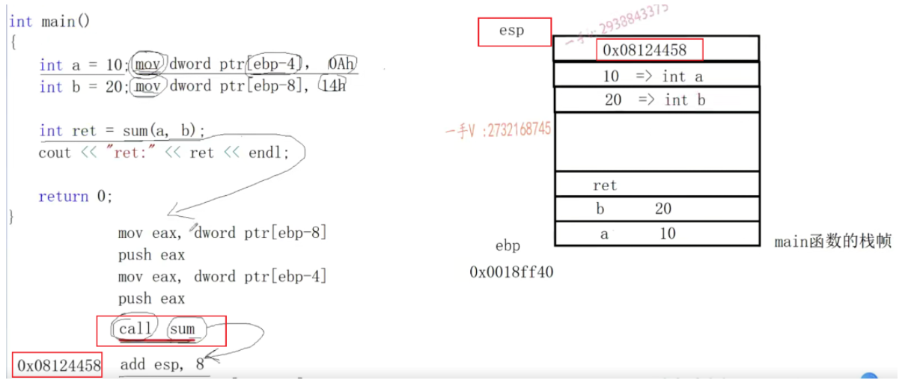
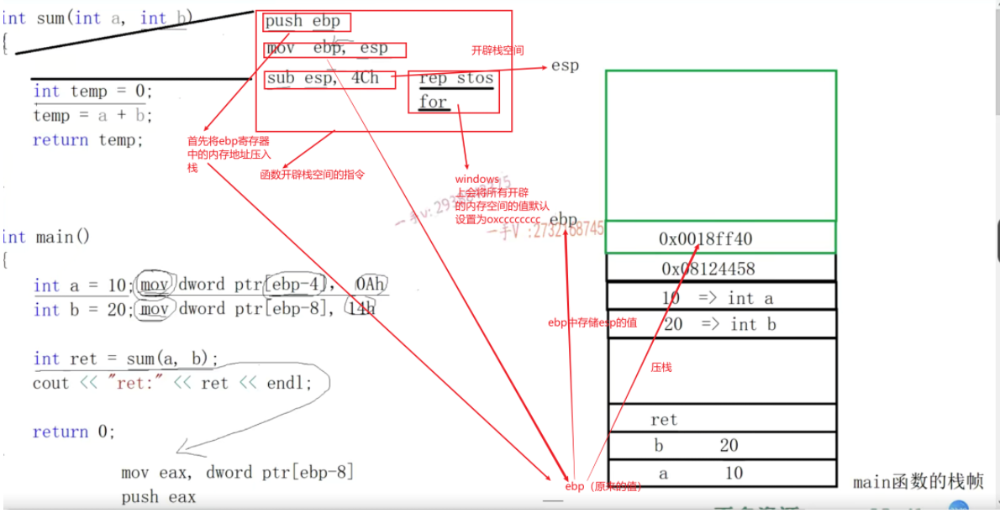
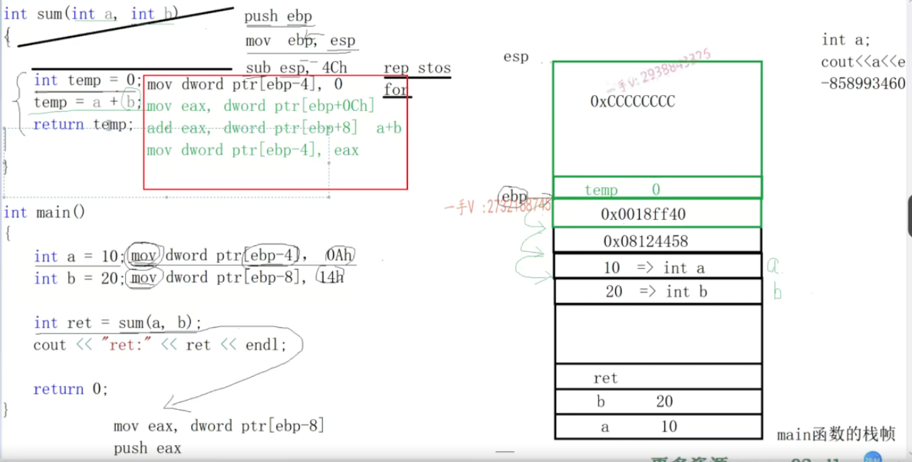
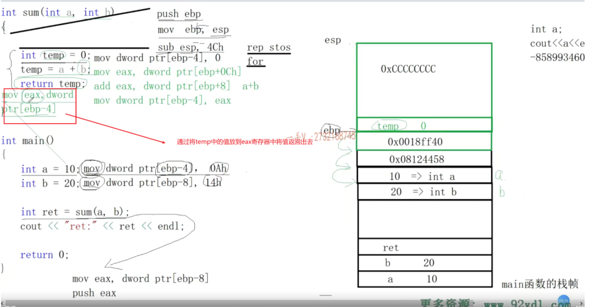
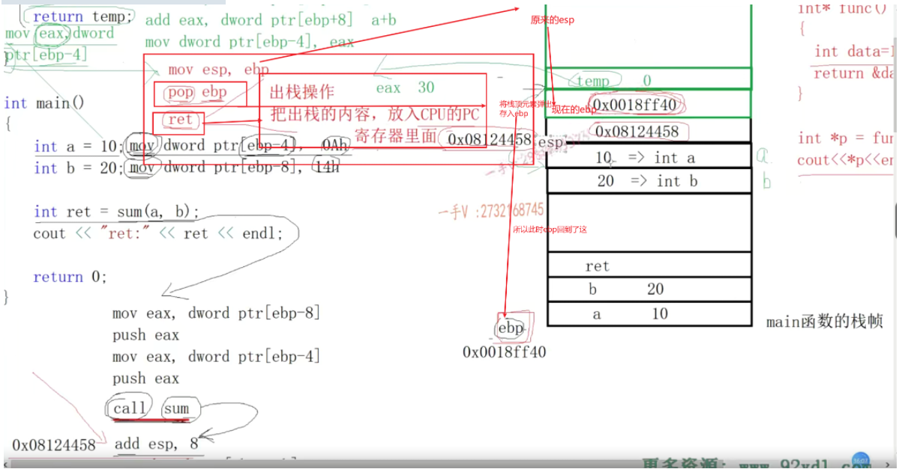
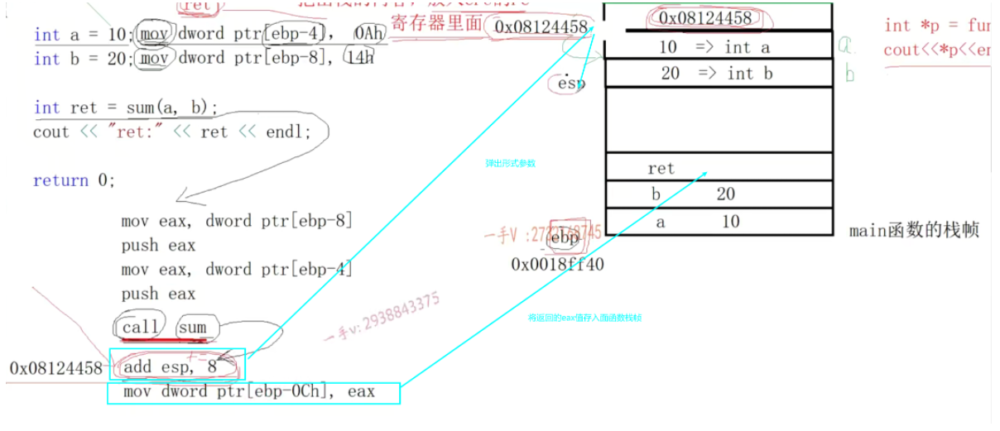

# ESP与EBP

在x86架构的汇编语言中，ESP（Extended Stack Pointer）和EBP（Extended Base Pointer）是两个特殊的寄存器，用于在程序执行过程中管理栈帧和局部变量。

1. ESP（Extended Stack Pointer）：
   - ESP寄存器指向当前线程的栈顶。在程序执行过程中，栈是由底向上生长的，ESP寄存器的值会随着栈的变化而变化。
   - 当调用一个函数时，会将函数的参数、返回地址和调用者函数的EBP值等信息压入栈中，然后更新ESP的值指向新的栈顶。
   - 当函数执行完成后，会将栈顶的数据出栈，同时恢复之前保存的EBP值，然后将ESP的值还原到之前的位置，用于返回上一级函数继续执行。
2. EBP（Extended Base Pointer）：
   - EBP寄存器用于指向当前函数的栈帧基址，也就是局部变量存储区的起始位置。
   - 在函数执行过程中，通过EBP可以方便地访问和管理函数的局部变量。
   - 在函数执行过程中，EBP的值一般在函数的开头被保存到栈中，然后在函数执行完成后再从栈中恢复，用于返回上一级函数。

总的来说，ESP用于指向当前线程的栈顶，管理栈空间的分配和释放；EBP用于指向当前函数的栈帧基址，方便访问和管理函数的局部变量。它们都是x86架构中重要的寄存器，用于支持函数调用和局部变量的处理。

**也就是说esp指向线程的栈顶，而ebp指向的是数据将要存放的位置**

压栈指令（pop，push）操作的会是esp寄存器，而存取数据移动数据的指令（mov）操作的会是ebp寄存器。

栈顶指正移动：

所以函数调用的过程中，形参内存空间，在调用函数的时候就已经开辟好了

接下来就是调用函数了：

**call指令的作用是给call指令下一行指令地址压栈。**

在函数中，从函数的大括号到第一条语句直接其实是有指令的！（同样的从最后一条语句到末尾的大扩号也是会有对应的指令的！）分配函数运行所需要的栈空间

执行sum方法里面的代码：

sum函数返回：

右大括号进行返回：

ret：1、出栈

​		2、将出栈的内容放入pc寄存器

回到主函数：

> 如果返回的值小于等于四字节，那么用eax寄存器返回

> 如果>4&&<=8 eax和edx返回

> 如果>8产生临时量带出返回值 