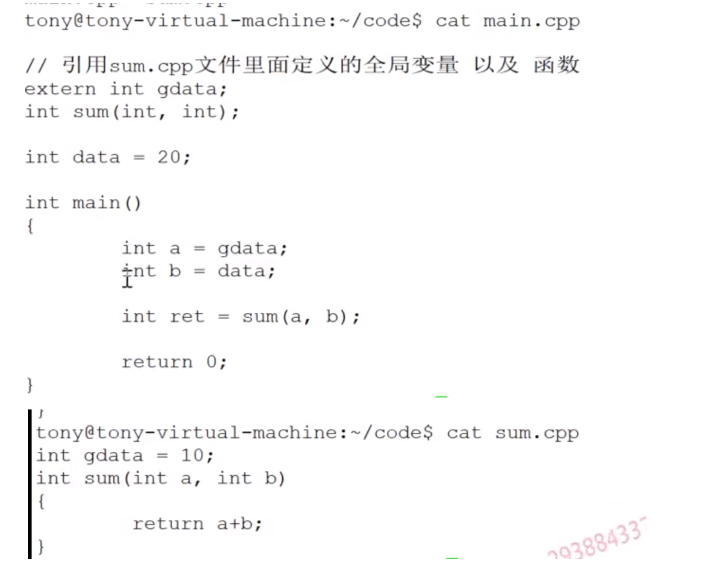

# 预编译：

处理#开头的命令（#include....) 

当然除开：#pragma命令（#pragma lib指定当前程序需要链接的库。#pragma link指定入口函数）**所以存活在链接阶段**

## #pragma

`#pragma`是C/C++编译器中的预处理指令，用于控制编译器的行为或提供一些特定的编译选项。它是以 `#pragma` 开头的一行特殊注释，编译器会根据这个指令来进行相应的处理。

`#pragma` 指令的具体使用方式和支持的选项取决于不同的编译器，因此在不同的编译器中可能有不同的效果和语法。

一些常见的 `#pragma` 指令包括：

1. `#pragma once`: 告诉编译器只包含一次当前头文件，防止多次包含。
2. `#pragma pack(n)`: 设定结构体或类成员的内存对齐方式。
3. `#pragma warning`: 控制编译器的警告输出。

需要注意的是，`#pragma` 指令不是C/C++语言的标准特性，而是编译器的扩展，因此不同的编译器可能支持不同的 `#pragma` 指令，而且在跨平台或跨编译器的情况下，使用 `#pragma` 指令可能会导致代码的可移植性问题。因此，尽量避免过度依赖于 `#pragma` 指令，以确保代码的可移植性和兼容性。

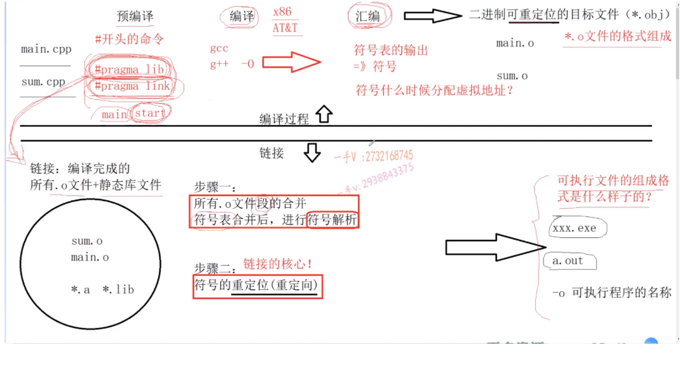

编译过程：预编译-----》编译-----》汇编------》二进制可重定位的目标文件（*.obj）

.cpp--->.o

重定位？

链接过程：.o + .a + .lib------->.exe or .out

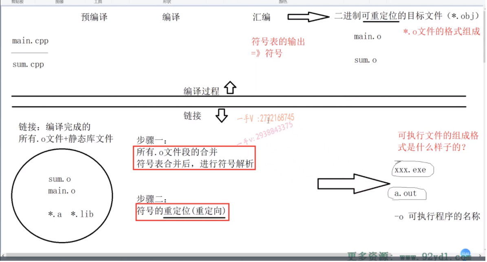

# **.o文件的格式组成是什么样子？可执行文件的组成格式是什么样子？**

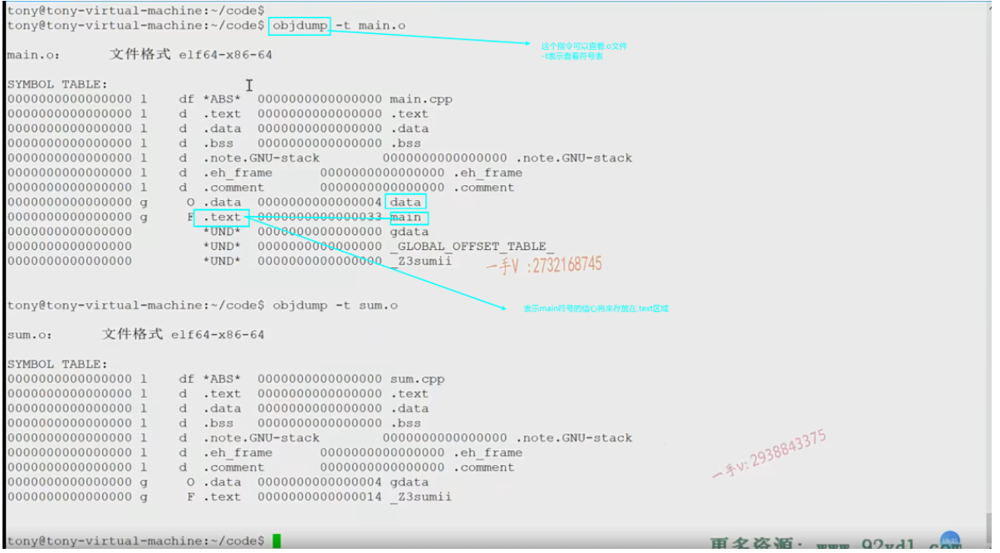

可以看到main.o的符号表中gdata和sum（_Z3sumii）（为啥是这个字符呢，因为函数的符号名是通过 函数名+形参列表生成的）都产生了符号但是对应的都是und（未定义）。und表示当前的.o文件中用到了这两个符号，但是由于还不知道这些符号具体怎么定义的（因为都是外部引用的）所以是会产生对应的符号，但是所在的内存区域是und

还可以看到这些符号的地址都是0000000所以在**编译的过程中符号是不分配虚拟地址的**

里面的l，g分别代表的符号的可见性，l表示local，g表示global。**所以对于链接器来说只能看到符号表中的范围为g的文件**。一般普通的为global，而静态变量为local

可以画一画.o文件的格式

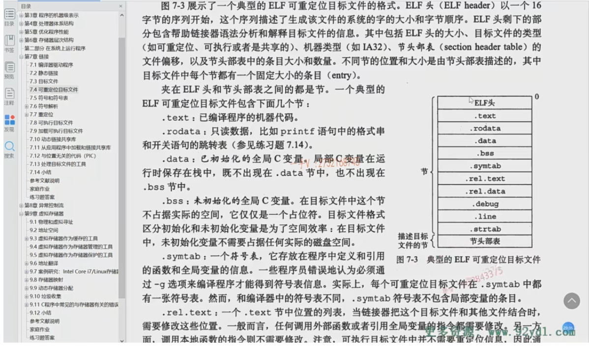

可以看到.o文件是由各种各样的段组成（ELF头 .text .rodate .bss .symtab）

通过命令：

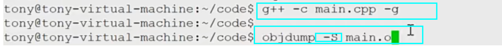

可以查看代码段的内容即.text

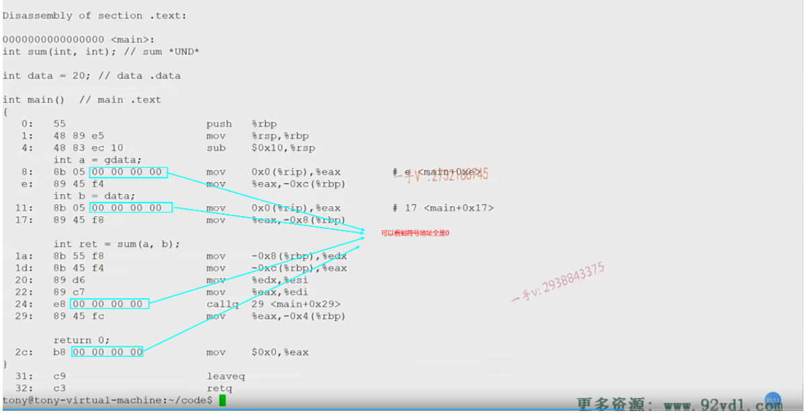

可以知道代码生成的指令在编译阶段就已经生成了，而所对应的符号的地址却还没填上（全是0），是因为还不知道会被分配到哪些地址，地址的确定需要到链接阶段才能生成

# **符号怎么理解？符号什么时候分配虚拟地址**

变量名方法名是符号。符号需要再链接过程才会分配虚拟地址(第一步，符号解析完成后)

# **链接的两个步骤？**

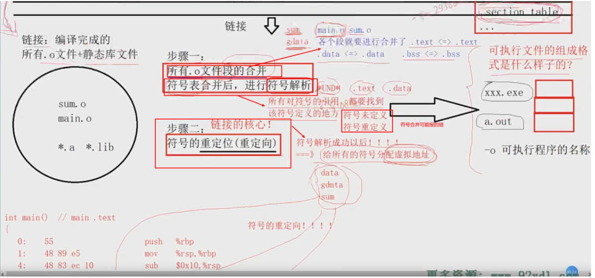

.o文件段的合并：main.o与sum.o各个段对应的合并成一个文件

符号表合并和符号解析：对于所有und的符号都要找到对应的该符号定义的地方，是定义在.text还是.data。不能找不到定义，也不能找到多个定义。

符号的重定位：符号解析成功之后需要给所有的符号分配虚拟地址。**然后需要将符号的虚拟地址对应的更新到引用了这些符号的代码段中**

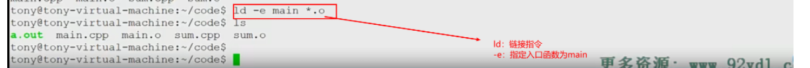

通过指令查看生成的可执行文件中的内容：

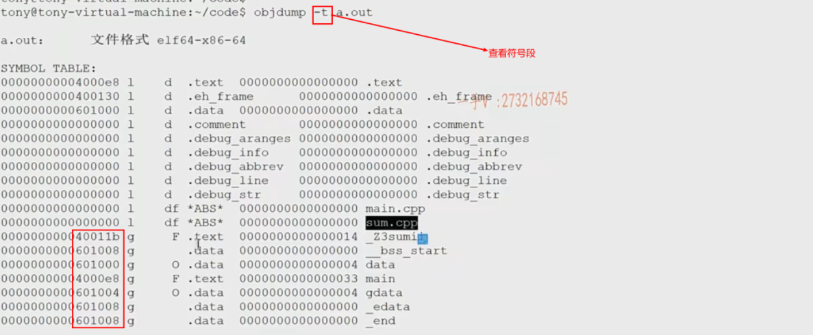

objdump -s a.out查看代码段：

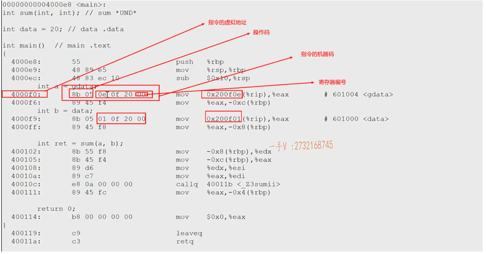

0e0f20但是实际值是200f0e可以知道此机器是**小端存储**

其中sum函数callq那里放的不是符号的地址而是符号的偏移量。即相对于本条指令的地址（40010c来说需要加0a才能得到sum函数开始的指令的地址

# 可执行文件头信息

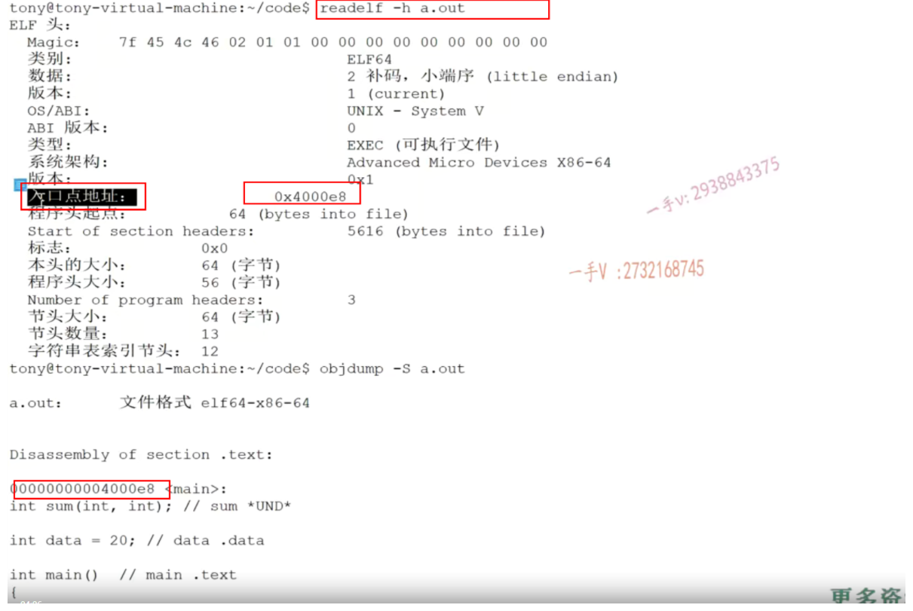

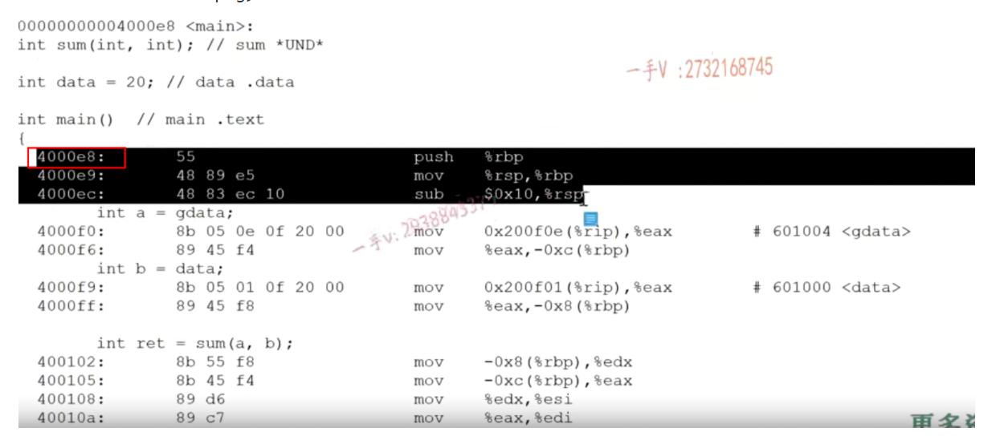

**所以程序如何找到入口函数，就是通过文件头中的入口点地址指定**

# 可执行文件的结构

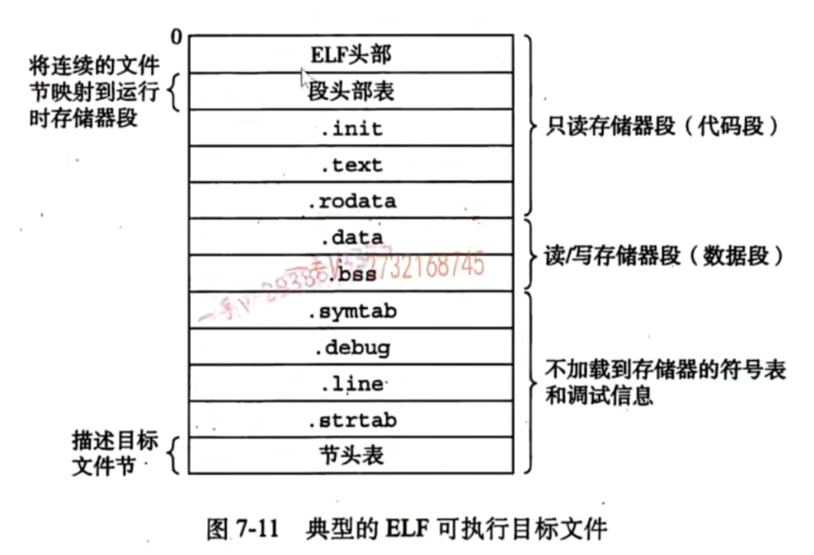

所以可执行文件与.o文件结构是相似的。但是可执行文件多出一个段叫做program header

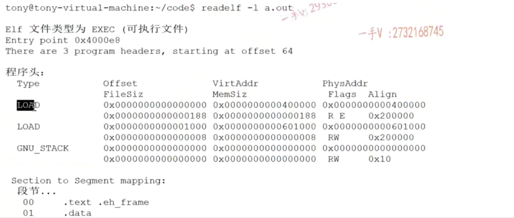

其中有两个Load，指示了程序被刚开始运行的时候，系统需要加载程序的那几个段到内存，可以看到加载了

.text .eh_frame                                    RE（可读可执行）

.data                                                      RW（可读可写）

这些段