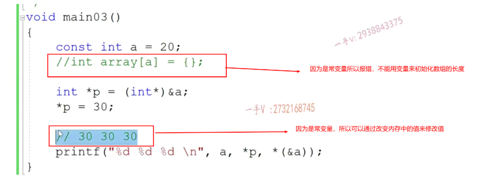
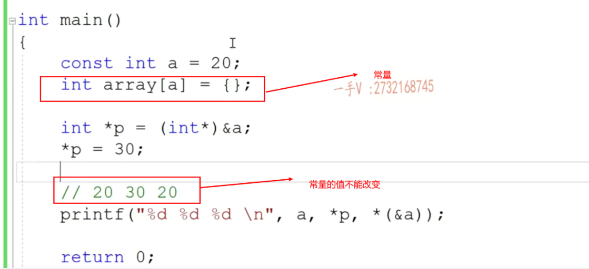

const--》指针--》引用--》在函数中的应用

const修饰的变量不能够不能作为左值.初始化完成之后，值不能被修改！！！

# C于C++中const的区别？

const的编译方式不同，c中，const就是当做一个变量来编译生成指令的。

C++中，所有出现const常量名字的地方，都被常量的初始化替换了！！

## C：
中const的变量，可以不用初始化

不叫做常量，叫做**常变量**



 const只是语法上保证不能修改，但是可以通过直接改变内存中的值来改变

c中，编译中const就是当做一个变量来编译生成指令的。

## C++

const必须初始化

叫做常量，所以声明数组的时候可以用来定义数组的长度



C++中，**编译时**所有出现const常量名字的地方，都被常量的初始化的值**替换**了！！（`int array[a] = {}`在编译的时候会替换成`int array[20] = {}`）

所以

```
int *p = (int*)&a;
*p = 30
```

实际上是将a指向的那片内存地址的值修改为了30，但是由于在编译的时候，所有用到a符号的地方都被替换成了常量20.

但是如果用一个变量来初始化const变量a，那么在编译的时候就是用符号b去替换所有的符号a,此时常量a，叫做常变量！！！

```c++
int b = 20;
const int a = b;
int array[a] = {};//编译后相当于int array[b] = {}
int *p = (int*)&a;//编译后相当于int *p = (int*)&b;
*p = 30;
//30 30 30
printf("%d %d %d \n",a, *p, *(&a));
```

