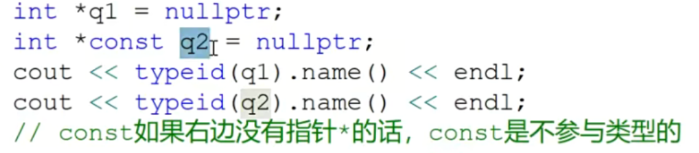
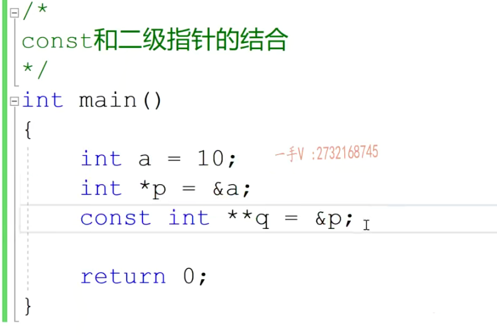
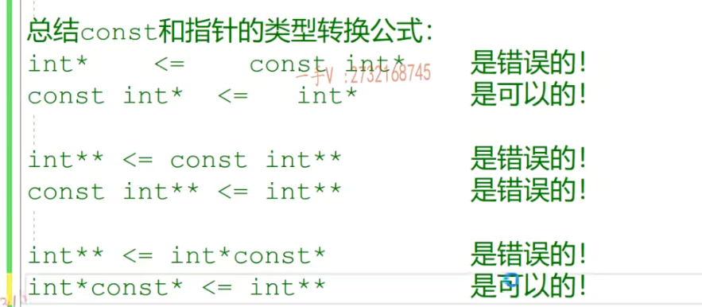

const修饰的常量常出现的错误是：

1、常量不能作为左值 《==== 直接修改常量的值

2、不能把常量的地址泄露给一个普通的指针或者普通的引用变量《==== 间接修改常量的值

# const和一级指针的结合

**C++的语言规范：const修饰的是离他最近的类型**

*是左值的时候表示这是个指针变量（也就是说他是个指针）

```c++
// const int *p; => *p不能被修改(*p = 20是不可的)，因为const修饰的类型是int，所以const修饰的表达式是*p，所以*p不能被修改。但是p是可以修改的(p = &a 是可以的)===>所以p可以任意指向不同的int类型的内存，但是不能通过指针间接修改指向的内存的值
// int const* p;修饰的还是int类型
// int *const p;修饰的int *类型,修饰的变量是p，指针p现在是常量，不能指向其他的内存，但是可以通过指针解引用修改指向的内存的值
// const int *const p;第一个const修饰的值是*p，第二个const修饰的值是p
```

**const修饰的是在const右边的所有**

* **const int \*p 修饰的是\*p，所以\*p(p指向的值）不可以修改**
* **int const* p 修饰的是\*p，所以\*p(p指向的值）不可修改**
* **int *const p 修饰的是p，所以变量p不可修改**
* **const int \*\*p 修饰的是\*\*p,所以\*\*p(p指向的值所指向的值)的值不可以修改**
* **int \* const \*p 修饰的是\*p,所以*p（p指向的值）不可以修改**
* 

总结const和指针的类型转化公式：




# const和二级（多级）指针的结合



