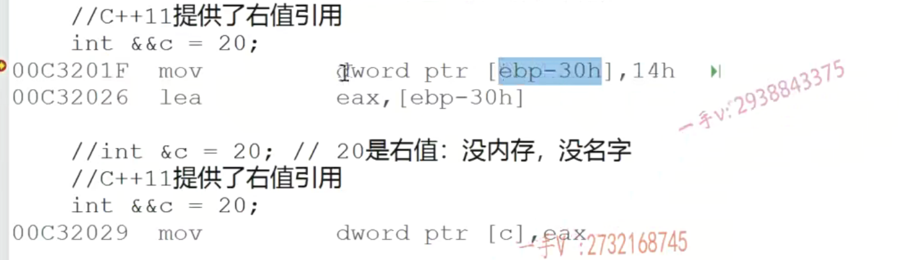

# 引用和指针的区别？

# 左值引用和右值引用

左值：有内存，有名字，值可以修改

右值：没内存（放在寄存器中），没名字

C++11提供了右值引用

int &&c = 20；



先将14h（20）放入临时变量中

然后将临时变量的地址放在eax寄存器中

然后将eax中的地址放入c的地址所指向的内存中

const int &d = 20；也是因为先产生了一个临时变量，然后将临时变量的地址给了d


右值引用


# 引用的实例

# 引用是一种更安全的指针。

## 1、引用是必须初始化的，指针可以不初始化


引用相当于给原来的变量取了一个别名

查看对应的汇编代码


lea eax,[a] 将a的地址的值复制到eax寄存器

lea是移动操作数的值，mov是操作数所指向地址的值

[]表示解引用

可以发现，用引用和用指针的汇编代码是一样的

引用的底层都是通过指针来完成的

所以下面代码是错误的

int &c = 20;//因为20无法取地址

## 引用只有一级引用，没有多级引用

## 定义一个引用变量和定义一个指针变量，其汇编指令是一模一样的；通过引用变量修改所引用的内存的值，和通过指针解引用修改指针指向的内存的值，其底层指令也是一模一样的

## 引用的定义

相当于将指针的定义中将等号右边的取地址（&）符号去掉，然后将左边的*改为&

所以按照类似的步骤定义数组的引用

```
int array[5] = {};
int (*p)[5]=&array======>int (&p)[5]=array;
```

