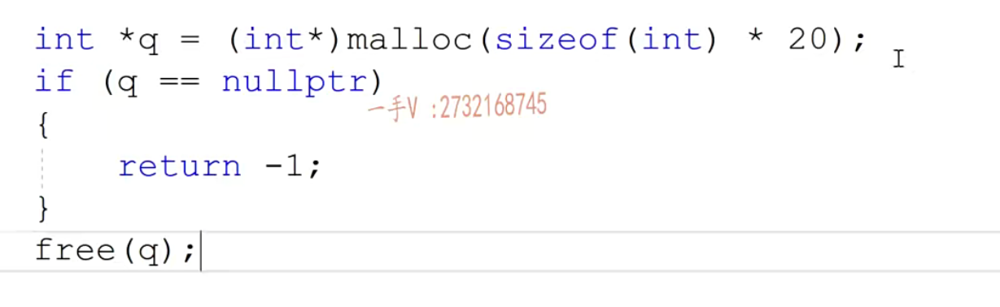

# new和delete的区别

# new和malloc的区别

# delete和free的区别

malloc跟free呢，它们本身是库函数。new跟delete在C++里边称作运算符。malloc开辟内存失败，是通过空指针来比较，而且malloc只负责开辟内存，不负责初始化。new又不仅可以开辟内存，还可以进行初始化。因为new在开辟内存的时候是指定类型的，所以它的返回值不需要进行类型强制，而malloc只是按字节开辟内存。只管开辟内存，不管内存里边放什么类型的数据，所以呢malloc永远返回的是void*，需要对返回值进行一个类型的这个转换。

那同样的delete跟free啊，那free呢，不管是释放单个儿元素内存，还是释放数组内存，就是一个标准的函数调用，只需要传入这个内存的起始地址就行了。而我们delete呢，在释放我们单个元素内存的时候呢，可释放数组内存有一个加不加中括号的问题。啊，你这个先用起来就是单个儿元素的释放，是不加中括号的数组内存的释放啊是要加中括号的啊，把这个要搞清楚搞清楚

malloc和free，称为c的运算符

new和delete，称为运算符

C：

C++：

new不仅可以做内存开辟，还可做内存的初始化操作

malloc开辟内存失败，是通过返回值和nullptr作比较；而new开辟内存失败，是通过抛出bad_alloc类型的异常来判断的。

malloc里面开辟数组

new开辟数组

释放开辟的内存

# new有多少种？

## 普通new

## 不抛出异常版

## 堆上开辟常量

所以这样编译会报错，要在int前面加上const：即：const int *p3 = new const int(40);

## 定位new

在指定的内存上划分出四字节大小的内存，并且初始值为50
