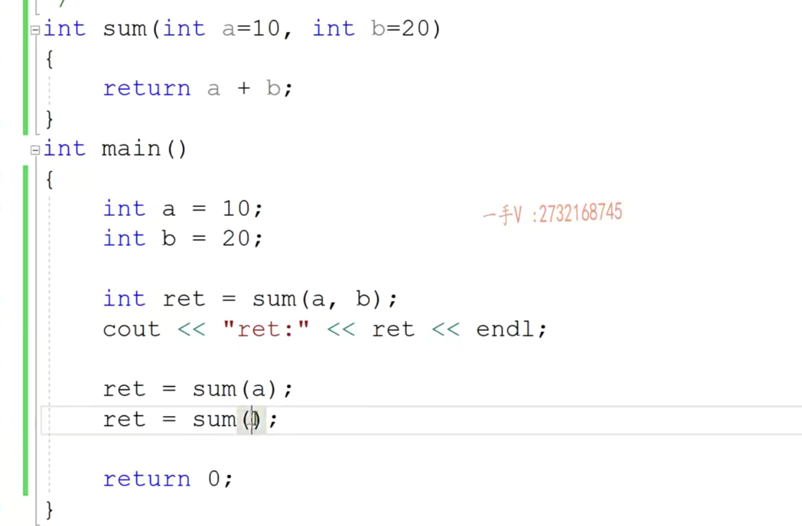
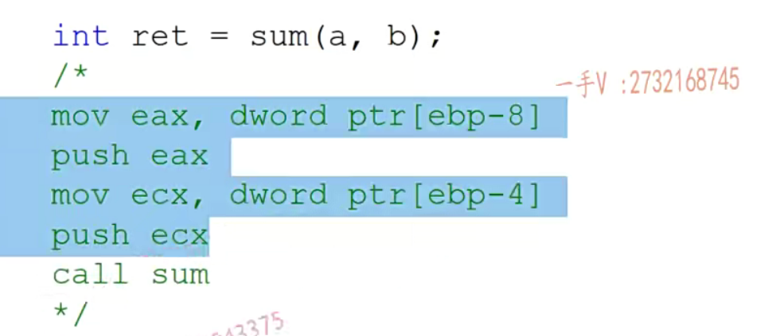
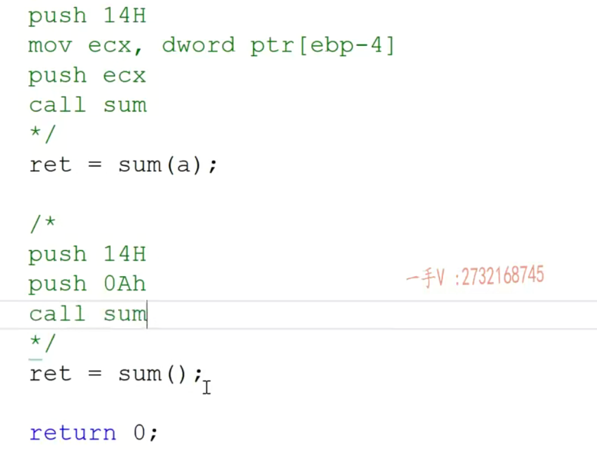
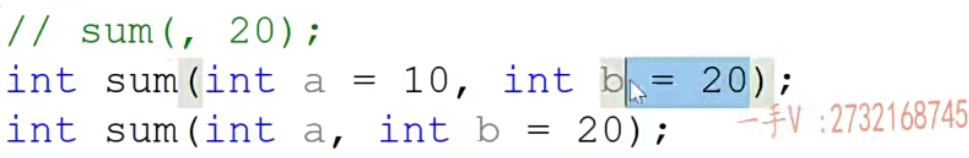

# 举一个简单例子



1、给默认值的时候，从右向左给

> 就是说先要给形参b赋默认值，而不能跳过形参b直接给a赋默认值
>
> ```c++
> int sum(int a = 10, int b){};//这样子是不行的
> ```

函数调用的过程中汇编代码为





2、调用带默认值的函数与调用不带默认值的函数相比性能有变好，因为少了mov指令

3、定义处可以给形参默认值，声明也可以给形参默认值

4、形参给默认值的时候，不管是定义处给，还是声明处给，形参默认值只能出现一次

如下图所示，错误


